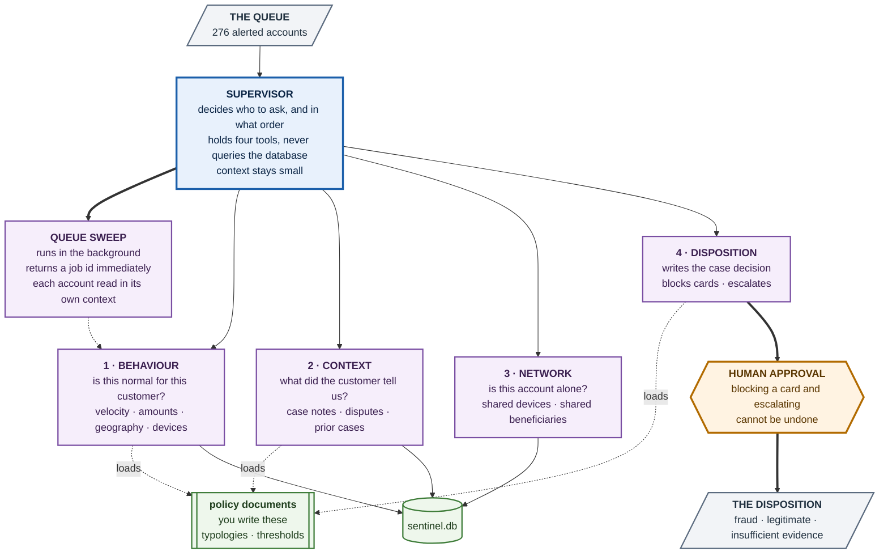
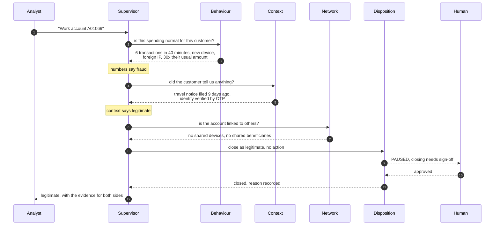

# Sentinel Fraud Detection Agent

This repository implements a local fraud-triage workflow for the Sentinel Bank.

## What it does

- reads `data/sentinel.db` only; job and approval state is stored separately in `data/sentinel_queue.db`
- invokes four isolated specialist tools: behaviour, context, network, and disposition
- gives the supervisor no database capability: it receives only each specialist's final finding
- loads editable thresholds and actions from `policies/*.md` at each specialist call
- pauses fraud actions for human approval; a sweep never auto-approves a card block
- starts an asynchronous queue sweep, then exposes status and result collection

## Video Link
https://youtu.be/n3mS8A03m4g?si=vjWtPzJDjYUaCB2x

## Run locally

1. Activate the project environment.
2. Run a single case:

   ```powershell
   .\.venv\Scripts\python.exe main.py
   ```

3. Or use the CLI directly:

   ```powershell
   .\.venv\Scripts\python.exe -m sentinel_app --case A00985
   .\.venv\Scripts\python.exe -m sentinel_app --queue
   .\.venv\Scripts\python.exe -m sentinel_app --status <JOB_ID>
   .\.venv\Scripts\python.exe -m sentinel_app --collect <JOB_ID>
   .\.venv\Scripts\python.exe -m sentinel_app --reports
   .\.venv\Scripts\python.exe -m sentinel_app --approve <APPROVAL_ID>
   .\.venv\Scripts\python.exe -m sentinel_app --reject <APPROVAL_ID>
   .\.venv\Scripts\python.exe -m sentinel_app --demo-approval
   ```

## Approval demo

The service includes a demonstration of the human review gate. A fraud verdict pauses before the irreversible action, and the system then resumes correctly on both approved and rejected paths.

## Verify the requirements

```powershell
# Run the tests, including the policy-edit demonstration
.\.venv\Scripts\python.exe -m pytest -q

# Start the worker (returns a job id immediately), then inspect it later
.\.venv\Scripts\python.exe -m sentinel_app --queue
.\.venv\Scripts\python.exe -m sentinel_app --status <JOB_ID>
.\.venv\Scripts\python.exe -m sentinel_app --collect <JOB_ID>

# Produce the 276 traceable dispositions and three evidence-led worked cases
.\.venv\Scripts\python.exe -m sentinel_app --reports
```

To demonstrate document-driven policy, edit `high_value_amount` in `policies/behaviour.md` and repeat a single case. The behaviour specialist reloads that file per invocation, so its final finding changes without a code change.

## Design note

The system is intentionally split into specialist tools and a routing-only supervisor, matching the assignment requirement that the supervisor should not own SQL access.

## Output files

Running `--reports` generates:

- `DISPOSITIONS.md`
- `CASES.md`
- `WRITEUP.md`

---

# Policy Engine, REST API, and CLI

This implementation adds three production-oriented layers to the Sentinel fraud system:

1. **Policy Engine** — Deterministic business/safety rules independent of the LLM
2. **REST API** — FastAPI endpoints for investigation submission, status polling, approval, and policy queries
3. **CLI** — Command-line interface to the same API

## Architecture

```text
User / Analyst
     │
     ├────────────────┬────────────────┐
     ▼                ▼                ▼
  Swagger            CLI           Direct SDK
     │                │                │
     └────────────────┼────────────────┘
                      ▼
                   FastAPI
                      │
              ┌───────┴───────┐
              ▼               ▼
            Policy        Approval Queue
              │               │
              └───────┬───────┘
                      ▼
                 LangGraph
                      │
                  Supervisor
                      │
         ┌────────────┼────────────┐
         ▼            ▼            ▼
    Behaviour      Context      Network
         └────────────┼────────────┘
                      ▼
                 Disposition
                      │
                      ▼
                    Policy
                      │
            ┌─────────┴─────────┐
            ▼                   ▼
          BLOCK            REQUIRE_APPROVAL
            │                   │
            ▼                   ▼
           SKIP              Human Approval
                                 │
                            ┌────┴────┐
                            ▼         ▼
                         APPROVE    REJECT
                            │         │
                            ▼         ▼
                         Execute     Skip
```



---

## How one case runs



## REST API

The system exposes a FastAPI server at `http://127.0.0.1:8000`.

### Start the API

```powershell
uvicorn api.queue_api:app --reload
```

### Swagger UI

Open:

```
http://127.0.0.1:8000/docs
```

### API Endpoints

#### Health Check

```bash
GET /api/v1/health
```

#### Submit Investigation

```bash
POST /api/v1/investigations
Content-Type: application/json

{
  "account_id": "A00985"
}
```

Response (202 Accepted):

```json
{
  "job_id": "abc123",
  "account_id": "A00985",
  "status": "queued",
  "graph_thread_id": "investigation-abc123"
}
```

#### Get Status

```bash
GET /api/v1/investigations/{job_id}
```

Possible statuses:

- `queued`: Investigation accepted
- `running`: Investigation in progress
- `waiting_approval`: Requires human approval
- `completed`: Investigation finished
- `failed`: Investigation error

#### Approve/Reject

```bash
POST /api/v1/investigations/{job_id}/approval
Content-Type: application/json

{
  "approved": true,
  "reason": "Reviewed evidence"
}
```

#### List Policies

```bash
GET /api/v1/policies
```

Returns:

```json
{
  "rules": [
    "rule_investigation_always_allowed",
    "rule_customer_locked",
    "rule_insufficient_evidence",
    "rule_fraud_requires_confidence",
    "rule_irreversible_actions_require_approval"
  ]
}
```

## Policy Engine

The policy engine is a deterministic layer that prevents the LLM from bypassing safety controls.

**Key principle**: LLM proposes; policy decides.

### Policy Decision Flow

The LLM can propose:

```json
{
  "verdict": "fraud",
  "confidence": "high",
  "proposed_action": "block_account"
}
```

But the policy engine independently evaluates whether the action is permitted:

1. **Is investigation** → Allow (evidence gathering is safe)
2. **Customer locked** → Block (account restrictions apply)
3. **Insufficient evidence** → Block (not enough data)
4. **Block account requires fraud + high confidence** → Validate verdict and confidence
5. **Irreversible actions require approval** → Require human approval for blocking/closing

### Policy Rules

```
rule_investigation_always_allowed      ← Non-destructive operations allowed
rule_customer_locked                   ← Locked accounts blocked from actions
rule_insufficient_evidence             ← Low confidence prevents action
rule_fraud_requires_confidence         ← Blocking needs fraud + high confidence
rule_irreversible_actions_require_approval ← Block/close need approval
```

### Fail-Closed

Unknown actions are blocked by default. This ensures that if a new action is added but no policy rule defines it, the system blocks rather than allows.

## CLI

The command-line interface provides access to the same API.

### Run CLI Command

Ensure the API is running in another terminal, then:

```powershell
python -m cli health
python -m cli policies
python -m cli investigate A00985
python -m cli investigate A00985 --wait
python -m cli status <JOB_ID>
python -m cli approve <JOB_ID> --reason "Reviewed evidence"
python -m cli reject <JOB_ID> --reason "Need more evidence"
python -m cli demo
```

### Example: Complete Flow via CLI

Terminal 1 — Start API:

```powershell
uvicorn api.queue_api:app --reload
```

Terminal 2 — Run CLI:

```powershell
# Check health
python -m cli health
# Output: {"status": "ok"}

# List policies
python -m cli policies
# Output: {"rules": ["rule_...", ...]}

# Submit investigation and wait
python -m cli investigate A00985 --wait
# Output:
# Investigation submitted.
# {
#   "job_id": "b6f3c8f2",
#   "account_id": "A00985",
#   "status": "queued",
#   "graph_thread_id": "investigation-b6f3c8f2"
# }
# Waiting for investigation...
#   status: queued
#   status: running
#   status: waiting_approval
# Investigation requires human approval.

# Approve
python -m cli approve b6f3c8f2 --reason "Reviewed fraud evidence"
# Output:
# Investigation approved.
# {
#   "job_id": "b6f3c8f2",
#   "approved": true,
#   "reason": "Reviewed fraud evidence",
#   "status": "completed"
# }
```

## Design Decisions

### Why Policy is Separate from LLM

Don't do this:

```python
if llm_confidence > 80%:
    execute()
```

Do this:

```python
disposition = llm.propose()
policy_result = policy_engine.evaluate(disposition)

if policy_result.decision == "ALLOW":
    execute()
elif policy_result.decision == "REQUIRE_APPROVAL":
    request_approval()
else:
    skip()
```

LLM reasoning is probabilistic. Fraud controls must be deterministic.

### Why Async Queue

The investigation can take longer than a normal HTTP request:

- Multiple model calls
- Database queries
- Human approval waits

The queue allows:

- API returns 202 Accepted immediately
- Investigation proceeds in background
- Caller polls status independently

### Why CLI Talks to API

The CLI intentionally communicates with the API instead of directly invoking the service.

This ensures:

- CLI and API use the same code path
- API behavior verified via CLI
- No drift between interfaces

### Why Human Approval Separate from Policy

**Policy** asks: Is the action permitted?
**Approval** asks: Has a human explicitly approved this permitted action?

```
Disposition
    ↓
Policy (allowed/blocked/require_approval)
    ↓
If require_approval:
    ↓
Human (approve/reject)
    ↓
Execution (if approved) or Skip (if rejected)
```

## Running Tests

```powershell
# All tests
pytest -q

# Policy tests
pytest tests/test_policy.py -q

# API tests
pytest tests/test_api.py -q

# CLI tests
pytest tests/test_cli.py -q

# Integration tests
pytest tests/test_triage.py -q
```

## Project Structure

```
sentinel-fraud-detection/
│
├── policy/                    # Policy engine
│   ├── __init__.py
│   ├── models.py             # PolicyDecision, PolicyAction, PolicyContext, PolicyResult
│   ├── rules.py              # Individual policy rules
│   └── engine.py             # Policy evaluation
│
├── api/                       # REST API layer
│   ├── __init__.py
│   ├── models.py             # API request/response schemas
│   ├── routes.py             # API endpoints
│   └── queue_api.py          # FastAPI application
│
├── cli/                       # Command-line interface
│   ├── __init__.py
│   ├── client.py             # HTTP client
│   ├── commands.py           # CLI commands
│   └── __main__.py           # Entry point
│
├── sentinel_app.py           # Core fraud triage service
├── main.py                   # Default CLI
│
├── tests/
│   ├── test_triage.py        # Integration tests
│   ├── test_policy.py        # Policy engine tests
│   ├── test_api.py           # API endpoint tests
│   └── test_cli.py           # CLI client tests
│
├── docs/
│   ├── architecture.md       # System architecture
│   ├── api.md                # API documentation
│   └── technical-decisions.md # Design rationale
│
├── data/
│   ├── sentinel.db           # Main database
│   └── sentinel_queue.db     # Queue metadata
│
├── policies/                 # Editable policy documents
│   ├── behaviour.md
│   ├── context.md
│   ├── network.md
│   └── disposition.md
│
└── README.md
```

## Summary

Batch 7-8 delivers:

- **Policy Engine**: Deterministic fraud controls independent of LLM
- **REST API**: FastAPI endpoints for investigation management
- **CLI**: Command-line access to the same API
- **Documentation**: Architecture, API, and technical decisions
- **Tests**: Unit and integration coverage

The system now enforces a clear safety boundary:

```
LLM proposes
    ↓
Policy decides
    ↓
Human approves
    ↓
System executes
```
